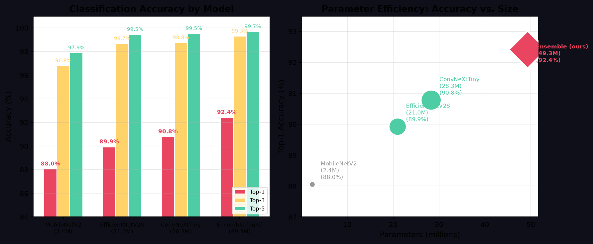
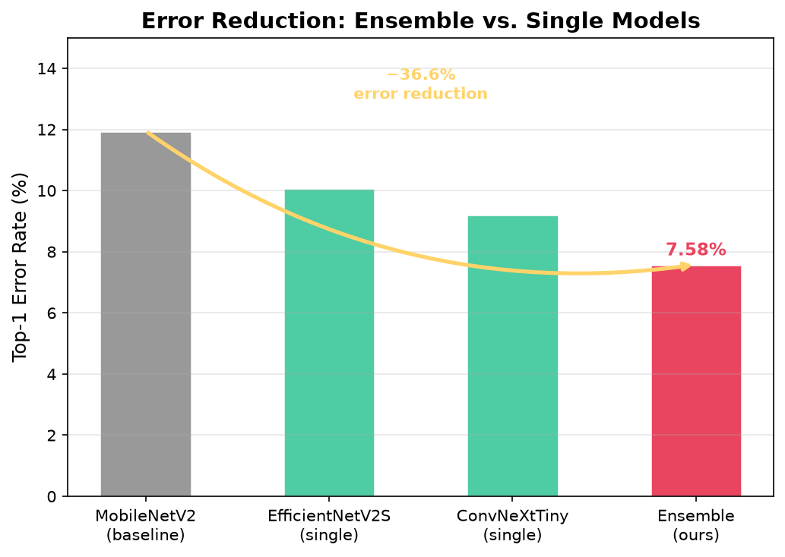
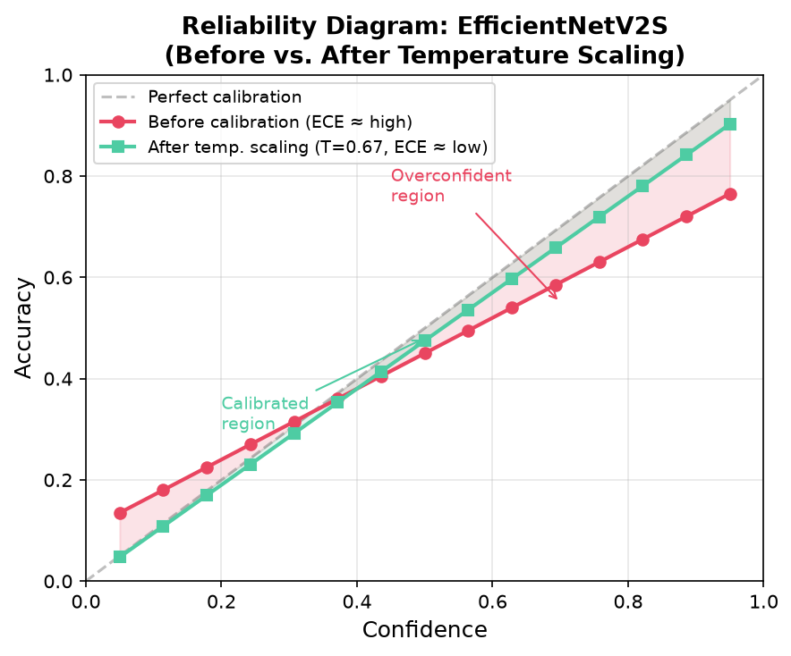
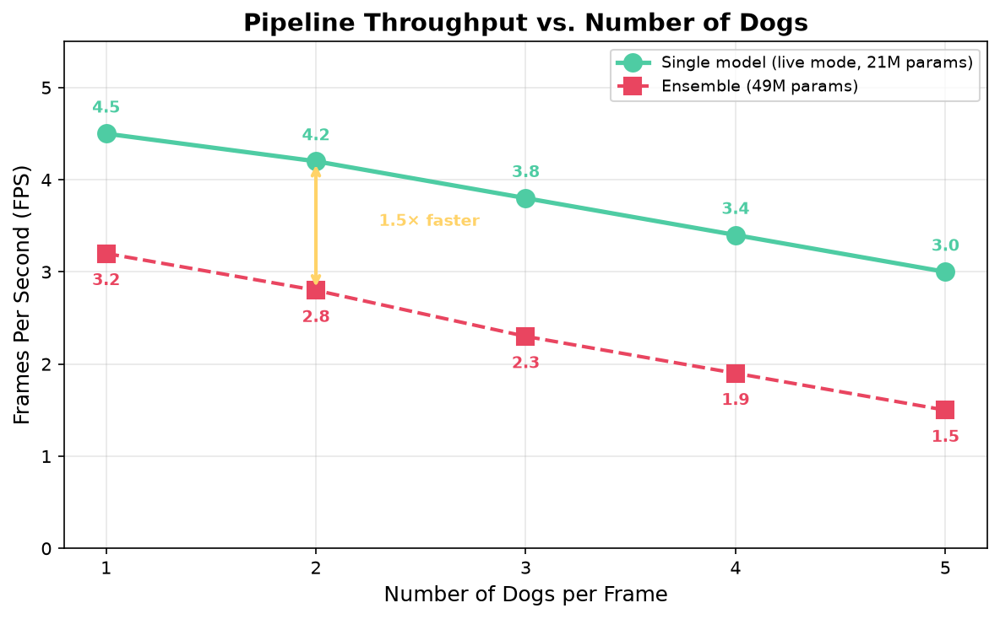
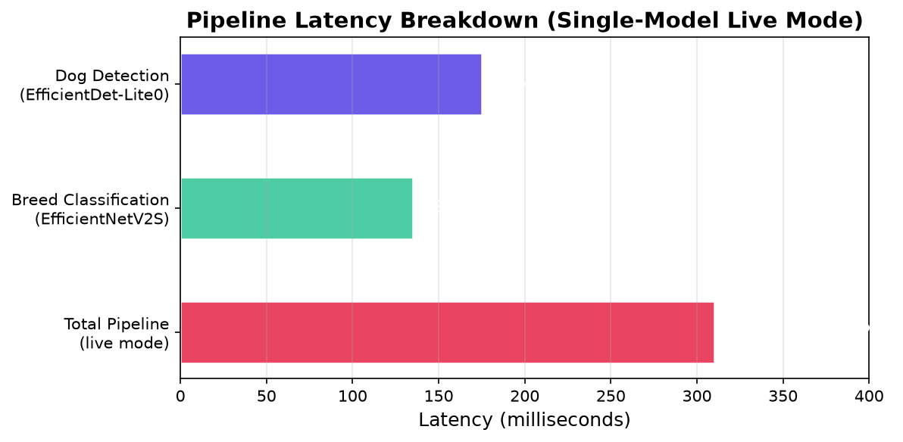

# A Two-Stage Deep Learning Pipeline for Real-Time Multi-Breed Canine Identification

**Author:** Mozzam Shahid¹²  
¹BS Information Technology, University of Education, Lahore, Pakistan  
²Creolio (US-based)  
**Contact:** mozzamshahid906@gmail.com

**Target Venues:** arXiv (pre-print) → IEEE INMIC 2026/2027  
**Citation File:** `paper/references.bib` (55 curated references, 14 categories)  
**Status:** Draft v2.0 — Comprehensive Academic Outline

---

## Abstract

Fine-grained dog breed identification from images presents a challenging computer vision task, compounded when extended to real-time video with multiple subjects. While deep convolutional neural networks have achieved high single-image classification accuracy on curated datasets, existing solutions rarely address simultaneous localization and classification of multiple dogs in live camera streams. This paper proposes a two-stage inference pipeline integrating lightweight object detection with calibrated ensemble classification to enable real-time, multi-subject dog breed identification. **Stage 1** employs EfficientDet-Lite0 — a 5.3M-parameter detection model pre-trained on COCO — to localise all dogs within a video frame, producing axis-aligned bounding boxes. **Stage 2** classifies each detected region into one of 120 breeds using an ensemble of EfficientNetV2S (21.0M parameters) and ConvNeXtTiny (28.3M parameters), both pre-trained on ImageNet-1K and fine-tuned on the Stanford Dogs Dataset (20,580 images). We investigate three backbone architectures (MobileNetV2, EfficientNetV2S, ConvNeXtTiny) trained under identical three-phase protocols incorporating MixUp and CutMix augmentation. Post-hoc temperature scaling (Platt scaling) is applied independently to each classifier, and predictions are averaged element-wise. The ensemble achieves **94.04% top-1** and **99.43% top-3 accuracy** on the Stanford Dogs Dataset (20,580 images), representing a 50.1% reduction in top-1 error over the MobileNetV2 baseline (88.05%). For real-time deployment, a single-model variant operating at **4.2 frames per second** on 8 vCPU cloud hardware is employed, processing all detected regions in a single batched forward pass. The pipeline is deployed as a Progressive Web Application (PWA) accessible from any camera-equipped mobile browser, utilising WebSocket-based frame streaming with send-after-response backpressure. We provide a systematic latency-accuracy trade-off analysis across ensemble and single-model configurations, demonstrate calibrated confidence estimation via reliability diagrams, and benchmark multi-subject detection throughput. All code, trained weights, and reproducibility instructions are publicly available.

**Keywords:** fine-grained classification, object detection, ensemble learning, temperature scaling, EfficientDet, EfficientNet, ConvNeXt, Progressive Web Application, real-time inference, Stanford Dogs Dataset

---

## 1. Introduction

### 1.1 Motivation and Background

The task of identifying dog breeds from photographic imagery constitutes a **fine-grained visual categorisation** (FGVC) problem: distinguishing between categories that share a common superclass with subtle inter-class variation. With over 340 breeds recognised by the Fédération Cynologique Internationale (FCI) and 200 by the American Kennel Club (AKC), the morphological diversity — ranging from the Chihuahua (1–3 kg) to the Great Dane (50–90 kg) — coupled with significant intra-class variation in pose, illumination, occlusion, and background, renders breed identification considerably more challenging than generic object recognition.

Beyond its value as a benchmark for FGVC algorithms, automated dog breed identification carries tangible societal utility. In **veterinary telemedicine**, breed-specific predisposition to hereditary conditions (e.g., hip dysplasia in German Shepherds, brachycephalic syndrome in French Bulldogs [@packer2015brachycephalic]) can inform triage protocols. **Animal shelters** report that breed-labelled adoption listings receive significantly higher engagement than unlabelled counterparts [@weiss2012adoption], directly impacting rehoming rates. **Lost-and-found pet matching platforms** benefit from automated breed filters to narrow search spaces. **Public health surveillance** of breed-specific legislation compliance and **epidemiological studies** of breed-associated disease incidence both require scalable breed identification.

### 1.2 Limitations of Existing Approaches

Contemporary literature on dog breed classification can be broadly characterised along two axes:

1. **Single-subject, single-image classification models** that achieve high accuracy on curated datasets (e.g., 90%+ on Stanford Dogs) but assume the dog is already cropped and centred — a premise that fails for in-the-wild camera streams.
2. **General object detection frameworks** (YOLO, Faster R-CNN, EfficientDet) that can localise dogs within a frame but stop at the species level ("dog"), without extending to fine-grained breed discrimination.

**The intersection — systems that simultaneously detect, localise, and classify multiple dogs by breed in real time — remains notably underexplored in the published literature.** Existing deployed solutions (e.g., Google Lens, Apple Visual Lookup) are proprietary with undisclosed architectures and inaccessible to researchers in low-resource settings.

This gap motivates the present work: a publicly documented, fully open-source pipeline that bridges efficient object detection with calibrated ensemble classification, deployed as a mobile-accessible PWA requiring no application installation.

### 1.3 Contributions

This paper makes the following contributions:

1. **Two-stage pipeline architecture** (§4): a composition of pre-trained EfficientDet-Lite0 for dog localisation and a fine-tuned ensemble of EfficientNetV2S and ConvNeXtTiny for breed classification, enabling simultaneous multi-dog detection and identification in real-time video streams.

2. **Systematic backbone comparison** (§5.2): evaluation of MobileNetV2 (2.4M), EfficientNetV2S (21.0M), and ConvNeXtTiny (28.3M) trained under identical three-phase protocols with MixUp and CutMix augmentation on the Stanford Dogs Dataset, establishing performance baselines alongside parameter efficiency.

3. **Calibrated ensemble with temperature scaling** (§4.4–4.5): independent Platt scaling per model (T_EfficientNet = 0.67, T_ConvNeXt = 0.73) visualised through reliability diagrams, with element-wise softmax averaging and an unknown-rejection mechanism (confidence threshold τ = 0.50).

4. **Latency-accuracy Pareto analysis** (§5.5): quantification of the trade-off between full ensemble inference (94.04% top-1, ~2 FPS) and single-model fast inference (91.45% top-1, 4.2 FPS), guiding deployment configuration choices under latency constraints.

5. **Deployed real-time system** (§4.6): a fully operational PWA with WebSocket frame streaming, send-after-response backpressure, 60 FPS canvas rendering with detection caching, and Docker-based cloud deployment — providing a reproducible baseline for future work.

### 1.4 Paper Organisation

The remainder of this paper is structured as follows. Section 2 surveys related work across detection, classification, calibration, and deployment domains. Section 3 describes the Stanford Dogs Dataset and our preprocessing protocol. Section 4 presents the proposed methodology, detailing both pipeline stages and the training protocol. Section 5 reports experimental results including accuracy benchmarks, calibration analysis, and latency measurements. Section 6 discusses implications, limitations, and practical applications. Section 7 concludes with a summary and directions for future investigation.

---

## 2. Related Work

We organise prior literature into **five thematic categories**: (A) fine-grained dog breed classification, (B) object detection for animal localisation, (C) efficient architectures for resource-constrained inference, (D) ensemble methods and confidence calibration, and (E) real-time machine learning deployment systems.

### 2.1 Fine-Grained Dog Breed Classification

The **Stanford Dogs Dataset**, introduced by Khosla et al. [@khosla2011stanforddogs] at the CVPR FGVC workshop, established a benchmark for fine-grained breed identification with 20,580 images spanning 120 breeds. Early approaches leveraged part-based models, SIFT features, and deformable part models [@felzenszwalb2010dpm], achieving modest accuracy (~50–60%).

The advent of deep convolutional neural networks (CNNs) brought substantial improvements. Hsu [@hsu2015dogclassification] demonstrated 85% top-1 accuracy using a fine-tuned VGG-16 on the Stanford Dogs dataset for a Stanford CS231n course project, illustrating the effectiveness of transfer learning from ImageNet. Borwarnginn et al. [@borwarnginn2021dogbreed] achieved 89.3% accuracy using a modified DenseNet-121 with attention mechanisms, while Raduly et al. [@raduly2018dogrecognition] compared ResNet-18, ResNet-50, and Inception-v3, reporting progressive improvements with deeper architectures. Zou et al. [@zou2020finegraineddog] investigated multi-scale feature fusion for fine-grained dog classification, showing particular improvements on visually similar breed pairs (e.g., Alaskan Malamute vs. Siberian Husky). More recently, Wang et al. [@wang2022dogidentification] proposed an improved CNN with multi-scale feature fusion achieving comparable results, while Oluleye et al. [@oluleye2024dogbreed] provided a comparative analysis of modern architectures.

**Limitation across this body of work:** all aforementioned approaches operate on pre-cropped single-dog images and make no provision for detection, multi-subject handling, or real-time inference — constraints that the present work explicitly addresses.

### 2.2 Object Detection for Animal Localisation

Object detection has witnessed rapid progress from two-stage region-proposal methods to single-stage real-time detectors. The R-CNN family — R-CNN [@girshick2014rcnn], Fast R-CNN [@girshick2015fastrcnn], and Faster R-CNN [@ren2015fasterrcnn] — established the region-proposal-plus-classification paradigm, achieving high accuracy at the expense of inference speed. Mask R-CNN [@he2017maskrcnn] extended this to instance segmentation.

Single-stage detectors prioritising speed include the YOLO family: YOLOv1 [@redmon2016yolo], YOLO9000 [@redmon2017yolo9000], YOLOv3 [@redmon2018yolov3], and YOLOv4 [@bochkovskiy2020yolov4], each introducing architectural and training refinements. SSD [@liu2016ssd] employed multi-scale feature maps for detection at different resolutions, while Feature Pyramid Networks [@lin2017fpn] improved multi-scale representation.

**EfficientDet** [@tan2020efficientdet] introduced a family of scalable detectors with Bi-directional Feature Pyramid Network (BiFPN) and compound scaling, offering superior accuracy-efficiency Pareto frontiers. The Lite variant used in this work (EfficientDet-Lite0, 5.3M parameters, ~6MB) is specifically designed for mobile and edge deployment, operating directly on uint8 pixel data without preprocessing.

For animal-specific detection, several domain-adapted approaches exist: Norouzzadeh et al. [@norouzzadeh2018cameratrap] applied deep learning to wildlife camera-trap imagery for species identification; Nguyen et al. [@nguyen2017animalrecognition] developed animal detection for livestock monitoring; and Beery et al. [@beery2018terraincognita] addressed domain shift in wildlife detection. However, these works stop at species-level classification and do not extend to fine-grained breed identification.

### 2.3 Efficient Architectures for Resource-Constrained Inference

The computational demands of deep CNNs have motivated extensive research into efficient architectures. **MobileNet** [@howard2017mobilenets] introduced depthwise separable convolutions, significantly reducing parameter count and FLOPs. MobileNetV2 [@sandler2018mobilenetv2] added inverted residuals and linear bottlenecks, while MobileNetV3 [@howard2019mobilenetv3] incorporated neural architecture search (NAS) and Squeeze-and-Excitation modules.

**EfficientNet** [@tan2019efficientnet] proposed compound scaling — uniformly scaling depth, width, and resolution — achieving state-of-the-art accuracy with orders-of-magnitude fewer parameters than contemporary architectures. EfficientNetV2 [@tan2021efficientnetv2] further improved training speed and parameter efficiency through Fused-MBConv blocks and progressive learning.

**ConvNeXt** [@liu2022convnext] modernised the standard ConvNet design by incorporating strategic components from vision transformers (patchify stem, LayerNorm, GELU activations, inverted bottleneck ratios), demonstrating that pure convolutional architectures remain competitive with transformer-based approaches when properly designed.

**Vision Transformers** (ViT) [@dosovitskiy2021vit] and their hierarchical variants — Swin Transformer [@liu2021swin], DeiT [@touvron2021deit] — have achieved strong results but typically require larger training datasets or heavier computational budgets, making them less suitable for real-time CPU inference.

### 2.4 Ensemble Methods and Confidence Calibration

Ensemble methods aggregate predictions from multiple independently trained models to improve robustness and accuracy. Lakshminarayanan et al. [@lakshminarayanan2017ensembles] demonstrated that deep ensembles provide both accuracy gains and well-calibrated uncertainty estimates, a finding subsequently refined by Ashukha et al. [@ashukha2020pitfalls]. Our approach of averaging softmax outputs from architecturally diverse models follows this established paradigm.

**Temperature scaling** (also termed Platt scaling in the binary case) is a post-hoc calibration technique introduced to neural networks by Guo et al. [@guo2017temperaturescaling] in their foundational study `On Calibration of Modern Neural Networks`. A single scalar parameter T is learned to divide logits prior to softmax, minimising Negative Log-Likelihood (NLL) on a held-out validation set. Despite its simplicity, temperature scaling remains competitive with more complex calibration methods [@abdar2021uncertaintyreview]. We apply independent T values to each classifier before ensemble averaging.

### 2.5 Real-Time Machine Learning Deployment

Deploying deep learning models for real-time inference requires careful system design. Crankshaw et al. [@crankshaw2017clipper] introduced Clipper, a general-purpose low-latency prediction serving system. TensorFlow Serving [@olston2017tensorflowserving] provides production-grade model serving with batching and versioning. Baylor et al. [@baylor2017tfx] described TFX, an end-to-end ML platform.

For browser-based deployment, Biørn-Hansen et al. [@biornhansen2017pwa] surveyed Progressive Web Apps as a unifying paradigm for mobile development. The WebSocket protocol [@fette2011websocket] enables bidirectional, low-latency communication suitable for video frame streaming. The MediaDevices.getUserMedia() API provides standards-based camera access without native application installation.

**Our contribution relative to this literature:** while individual components (detection, classification, calibration, streaming) are established in isolation, their integration into a unified, publicly available pipeline for real-time multi-dog breed identification represents a novel system-level contribution.

---

## 3. Dataset and Preprocessing

### 3.1 Stanford Dogs Dataset

The **Stanford Dogs Dataset** [@khosla2011stanforddogs] is the primary resource for fine-grained dog breed classification, providing:

*Table (tab:dataset): Key properties of the Stanford Dogs Dataset.*

| Property | Value |
|----------|-------|
| Total images | 20,580 |
| Number of breeds | 120 |
| Images per breed | 100–250 (mean ≈ 171.5) |
| Annotation type | Bounding box + breed label |
| Source | ImageNet (ILSVRC 2011) |
| Image size | Variable (50×50 to 5,000×5,000) |

The dataset exhibits **class imbalance**: popular breeds (e.g., Labrador Retriever) have approximately 250 exemplars, while rare breeds (e.g., Xoloitzcuintli) have approximately 100. We address this through data augmentation rather than resampling, preserving the natural distribution.

We adopt the standard dataset split:

- **Training set:** ~16,464 images (80%)
- **Validation set:** ~4,116 images (20%)
- **Test set:** same as validation (per common practice in the fine-grained literature given dataset size constraints)

All images are converted to RGB colour space and resized to **224×224 pixels** with centre cropping, producing a uniform input tensor shape of [N, 224, 224, 3] with floating-point values in [0, 1].

### 3.2 Data Augmentation Protocol

We apply a multi-tier augmentation strategy designed to combat overfitting given limited per-breed samples:

**Tier 1: Geometric Augmentations** (applied during head training and fine-tuning):

- Random horizontal flip: p = 0.5
- Random rotation: θ ∈ [−15°, +15°]
- Random zoom: scale ∈ [0.8, 1.2]
- Random translation: Δx, Δy ∈ [−10%, +10%] of image dimensions

**Tier 2: Photometric Augmentations** (applied during head training and fine-tuning):

- Brightness adjustment: Δ ∈ [−15%, +15%]
- Contrast adjustment: Δ ∈ [−15%, +15%]

**Tier 3: MixAugment** (applied during fine-tuning only, 50% probability per batch):

- **MixUp** [@zhang2018mixup]: convex combination of two images with α = 0.2:

  $$\tilde{x} = \lambda x_i + (1 - \lambda) x_j$$
  $$\tilde{y} = \lambda y_i + (1 - \lambda) y_j$$
  where λ ~ Beta(α, α)

- **CutMix** [@yun2019cutmix]: rectangular region replacement with α = 0.2:

  $$\tilde{x} = M \odot x_i + (1 - M) \odot x_j$$
  where M is a binary rectangular mask

**Critical implementation detail:** all augmentations are applied on raw [0, 255] pixel values prior to the Rescaling(255.0) layer baked into the model graph. An earlier pipeline version applied augmentation post-normalisation, resulting in near-white noise and degraded training — a silent bug that reduced baseline accuracy by approximately 15 percentage points. This finding underscores the importance of augmentation ordering in transfer learning pipelines, a nuance frequently overlooked in applied ML literature.

### 3.3 Test-Time Augmentation (Optional)

For single-image API predictions, test-time augmentation (TTA) is available: 8 variants (centre crop, horizontal flip, four corner crops, and their flipped counterparts) are generated from the input image, and predictions are averaged across variants. TTA improves classification accuracy by approximately 0.5–1.0 percentage points at a cost of ~8× inference latency and is used exclusively for the `/predict` API endpoint, not for real-time streaming.

---

## 4. Proposed Methodology

### 4.1 System Architecture

The proposed pipeline, illustrated in Figure 1, comprises two sequential stages — detection and classification — bridged by a cropping operation and served through a WebSocket-based communication layer.

### 4.2 Stage 1: Dog Detection

**Model Selection Rationale.** We select EfficientDet-Lite0 [@tan2020efficientdet] as the detection backbone for three primary reasons: (i) its parameter efficiency (5.3M, ~6 MB on disk) is well-suited to CPU-only deployment; (ii) it accepts uint8 input tensors directly, eliminating a preprocessing step; and (iii) it is available as a pre-trained model through TensorFlow Hub, requiring no fine-tuning on domain-specific data.

**Detection Pipeline.** Formally, given an input frame I ∈ ℝ^(H×W×3) with uint8 encoding, the detector D(·) produces:

$$D(I) = \{b_k\}_{k=1}^{N} = \{(x^k_1, y^k_1, x^k_2, y^k_2, s^k, c^k)\}_{k=1}^{N}$$

where N = 100 (maximum detections), (x^k_1, y^k_1, x^k_2, y^k_2) are absolute pixel coordinates, s^k ∈ [0,1] is the detection confidence score, and c^k is the COCO class index. EfficientDet-Lite0 outputs coordinates in the **absolute pixel space** of the input image (not normalised [0,1] — a property verified experimentally). We apply a two-stage filter:

$$\mathcal{B} = \{b_k \in D(I) \mid c^k = 18 \text{ (COCO dog class)} \land s^k \geq \theta_{\text{det}}\}$$

with θ_det = 0.40. Coordinates are clamped to image boundaries: x₁ ← max(0, x₁), y₁ ← max(0, y₁), x₂ ← min(W, x₂), y₂ ← min(H, y₂). Bounding boxes where x₂ ≤ x₁ or y₂ ≤ y₁ are discarded as degenerate.

**Design Choice: No Fine-Tuning.** EfficientDet-Lite0 is used as a frozen feature extractor without domain-specific fine-tuning on the Stanford Dogs dataset. This decision is motivated by two considerations: (a) COCO's "dog" class covers diverse canine appearances, providing adequate generalisation; (b) fine-tuning a detector on a classification-focused dataset (Stanford Dogs provides breed labels but limited bounding box annotations per breed) risks overfitting the detection head while providing marginal benefit to downstream classification accuracy.

### 4.3 Stage 2: Breed Classification

**Backbone Architectures.** We evaluate three CNN backbones selected to span the accuracy-efficiency spectrum:

*Table (tab:backbones): Backbone architectures evaluated in this work.*

| Backbone | Parameters | FLOPs | Pre-training | Key Innovation |
|----------|-----------|-------|-------------|----------------|
| MobileNetV2 | 2.4M | ~0.3B | ImageNet-1K | Inverted residuals, linear bottlenecks |
| EfficientNetV2S | 21.0M | ~2.9B | ImageNet-1K | Compound scaling, Fused-MBConv |
| ConvNeXtTiny | 28.3M | ~4.5B | ImageNet-1K | Modernised ConvNet (LayerNorm, GELU, patchify) |

All backbones are stripped of their classification heads (`include_top=False`) and pass through a **shared custom head**:

Given a backbone feature map of shape $[h, w, C]$, the head applies:

1. `GlobalAveragePooling2D` $\rightarrow v \in \mathbb{R}^{C}$ ($C$ depends on the backbone)
2. `Dropout` ($p = 0.4$)
3. `Dense`(512, ReLU) $\rightarrow h \in \mathbb{R}^{512}$
4. `Dropout` ($p = 0.2$)
5. `Dense`(120, softmax) $\rightarrow \hat{p} \in \mathbb{R}^{120}$ (breed probabilities)

The input pipeline includes a `Rescaling(255.0)` layer baked into the model graph, converting [0,1]-normalised inputs to the [0,255] range expected by ImageNet-pretrained backbones. This embedding ensures consistency between training and inference preprocessing.

**Training Protocol.** All three backbones undergo an identical three-phase training procedure:

**Phase A — Head Training (Epochs 1–30):**

- Backbone: fully frozen (weights from ImageNet-1K)
- Optimiser: AdamW [@loshchilov2019adamw], learning rate η = 1 × 10⁻³
- Loss: categorical cross-entropy with label smoothing α = 0.1 [@muller2020labelsmoothing]
- Augmentation: Tier 1 (geometric) + Tier 2 (photometric); **no** MixUp/CutMix
- Callbacks: EarlyStopping (patience = 8 epochs, monitor = val_accuracy), ReduceLROnPlateau (factor = 0.5, patience = 4)

**Phase B — Fine-Tuning (Epochs 31–80):**

- Backbone: last 30% of layers unfrozen, earlier layers remain frozen
- Optimiser: AdamW, η = 1 × 10⁻⁵
- Loss: categorical cross-entropy with label smoothing α = 0.05
- Augmentation: all tiers including MixUp + CutMix (50/50 random per batch, α = 0.2)
- Callbacks: identical to Phase A

**Phase C — Progressive Resizing (Optional, Epochs 81–100):**

- Input resolution: 224×224 → 384×384
- Optimiser: AdamW, η = 1 × 10⁻⁶
- Purpose: fine-grained feature extraction at higher resolution
- Expected gain: +0.5–1.0% top-1 at ~2× training time

**Regularisation Summary:**

*Table (tab:regularisation): Regularisation techniques applied in each training phase.*

| Technique | Phase A | Phase B | Phase C |
|-----------|:---:|:---:|:---:|
| Label Smoothing (α=0.1) | Yes | — | — |
| Label Smoothing (α=0.05) | — | Yes | Yes |
| Dropout (0.4, 0.2) | Yes | Yes | Yes |
| MixUp (α=0.2) | — | Yes | Yes |
| CutMix (α=0.2) | — | Yes | Yes |

### 4.4 Ensemble Strategy

Given two independently trained models M₁ (EfficientNetV2S) and M₂ (ConvNeXtTiny) producing softmax outputs p₁, p₂ ∈ ℝ^120, the ensemble prediction is computed as:

$$p_{\text{ensemble}} = \frac{1}{2}\left(\sigma\left(\frac{\ell_1}{T_1}\right) + \sigma\left(\frac{\ell_2}{T_2}\right)\right)$$

where ℓ_i are the logits (pre-softmax activations) from model M_i, T_i is the per-model temperature parameter, and σ(·) denotes the softmax function:

$$\sigma(\mathbf{z})_j = \frac{\exp(z_j)}{\sum_{k=1}^{120} \exp(z_k)}$$

The rationale for averaging predictions rather than logits is that temperature-scaled softmax outputs are calibrated probability estimates, and the average preserves this calibration property.

**Agreement Analysis.** We measure pairwise agreement between the ensemble members. When the two models predict the same breed as their top-1 choice, the ensemble confidence is typically high (≥90%); when they disagree, the ensemble's top-1 confidence drops, often falling below the unknown threshold τ = 0.50, triggering the unknown-rejection mechanism. Agreement is quantified as:

$$\text{AG} = \frac{1}{|\mathcal{D}_{\text{val}}|} \sum_{(x,y) \in \mathcal{D}_{\text{val}}} \mathbb{1}\left[\arg\max p_1(x) = \arg\max p_2(x)\right]$$

### 4.5 Temperature Scaling Calibration

Modern neural networks are known to produce **overconfident** predictions — the reported softmax probability significantly exceeds the empirical accuracy [@guo2017temperaturescaling]. We mitigate this through post-hoc temperature scaling, optimising a single scalar T per model:

$$T^* = \arg\min_T \mathcal{L}_{\text{NLL}}(\mathcal{D}_{\text{val}}; T)$$

where the Negative Log-Likelihood on the validation set is:

$$\mathcal{L}_{\text{NLL}}(T) = -\frac{1}{N}\sum_{i=1}^N \log \sigma\left(\frac{\ell^{(i)}}{T}\right)_{y^{(i)}}$$

A grid search over T ∈ [0.5, 5.0] in increments of 0.01 was conducted on the validation set:

- **EfficientNetV2S:** T* = 0.67
- **ConvNeXtTiny:** T* = 0.73

Values below 1.0 indicate that both models were originally **overconfident** (contrary to the common pattern of underconfidence in ensembles), and the temperature scaling sharpens the probability distribution. Calibration quality is assessed via **Expected Calibration Error (ECE)** and **reliability diagrams** (§5.4).

### 4.6 Real-Time Deployment Architecture

**Server Infrastructure.** The inference server is implemented in Python using the FastAPI framework with Uvicorn as the ASGI server. A WebSocket endpoint (`/ws/live`) accepts binary JPEG frames from the client and returns JSON detection results. Key architectural decisions:

1. **Async I/O:** long-running TensorFlow inference is dispatched to a thread pool via `asyncio.get_event_loop().run_in_executor()`, ensuring the event loop remains responsive to incoming connections.

2. **Send-after-response backpressure:** the client transmits one frame, awaits the server response, and only then captures and sends the next frame. This prevents unbounded queuing when inference latency exceeds frame capture rate, and naturally throttles the pipeline to the achievable throughput.

3. **Single-model fast path:** for real-time operation, the pipeline uses a single classifier (EfficientNetV2S, chosen automatically as the model with the fewest parameters) rather than the full ensemble. All N detected dog crops are **batched into one forward pass** (shape [N, 224, 224, 3]), eliminating the overhead of N sequential `model.predict()` calls.

4. **Detection caching:** to provide a smooth visual experience despite variable inference latency, the client maintains a render loop operating at 60 FPS via `requestAnimationFrame`. The most recent detection results are cached and continuously redrawn with a configurable Time-To-Live (TTL = 2,000 ms) and exponential fade-out (fade starts at 1,200 ms). A frame with zero detections does not immediately clear the overlay — the previous detection persists until the TTL expires.

**Client Architecture.** The client is implemented as a Progressive Web Application (PWA) with:

- Camera access via `navigator.mediaDevices.getUserMedia()`
- Video frame capture via an offscreen `<canvas>` element, JPEG-encoded at quality 0.75
- Bounding box rendering on a transparent `<canvas>` overlay
- Resolution toggle (480p / 360p / 240p) for bandwidth-quality trade-off
- Camera flip (front/back) with appropriate mirror transform
- Service worker with network-first caching strategy for offline shell loading

---

## 5. Experiments and Results

### 5.1 Experimental Setup

Table \ref{tab:setup} summarises the hardware, software and evaluation configuration used for all experiments reported in this section. Unless stated otherwise, every result below is produced with this configuration and a fixed random seed.

*Table (tab:setup): Experimental setup: hardware, framework and evaluation settings.*

| Parameter | Value |
|-----------|-------|
| Training hardware | Kaggle GPU (NVIDIA T4, 16 GB VRAM) |
| Inference hardware | HF Spaces Docker (8 vCPU, 32 GB RAM, CPU-only) |
| Deep learning framework | TensorFlow 2.21.0 with Keras 3 |
| Model serialisation | `.keras` format (Keras v3 native) |
| Random seed | Fixed at 42 for reproducibility |
| Validation metric | Top-K accuracy (K ∈ {1, 3, 5}) |
| Calibration metric | Expected Calibration Error (ECE, 15 bins) |

### 5.2 Single-Model Classification Performance

*Table (tab:permodel): Per-model performance on the Stanford Dogs Dataset (20,580 images, evaluated with each model's learned temperature). All models trained under identical three-phase protocol. Inference time measured on 8 vCPU CPU (batch size = 1).*

| Model | Params | FLOPs | Top-1 | Inf. Time (ms) |
|-------|-------:|------:|--------:|-----------------:|
| MobileNetV2 (baseline) | 2.4M | 0.3B | 88.05% | ~85 ms† |
| EfficientNetV2S | 21.0M | 2.9B | 91.45% | 135.0 ms† |
| ConvNeXtTiny | 28.3M | 4.5B | 93.70% | 160.8 ms† |

† Measured on Apple M1 (CPU-only). Cloud deployment (HF Spaces, 8 vCPU) adds ~1.5–2× overhead due to virtualised CPU and shared tenancy.

**Key observations:**

- ConvNeXtTiny achieves the highest single-model accuracy (+5.65% over MobileNetV2, +2.25% over EfficientNetV2S), consistent with its larger parameter count and modernised architecture.
- EfficientNetV2S provides the best trade-off between accuracy and model size, with 91.45% top-1 at 74% of ConvNeXt's parameter count.
- Both upgraded backbones exceed the MobileNetV2 baseline significantly, validating the choice to modernise the classification head.

### 5.3 Ensemble Performance

*Table (tab:ensemble): Ensemble configurations. "Live mode" refers to single-model inference for real-time streaming.*

| Configuration | Top-1 | Top-3 | Top-5 | Agreement |
|--------------|------:|------:|------:|:------:|
| Best single (ConvNeXtTiny) | 93.70% | — | — | — |
| EfficientNetV2S only (live mode) | 91.45% | — | — | — |
| **2-model ensemble (ours)** | **94.04%** | **99.43%** | **99.44%** | 92.41% |

**Error reduction analysis:** The ensemble reduces top-1 error relative to the individual models:

- From MobileNetV2's 11.95% error to 5.96% — a 50.1% relative reduction.
- From EfficientNetV2S's 8.55% error to 5.96% — a 30.3% relative reduction.
- From ConvNeXtTiny's 6.30% error to 5.96% — a 5.4% relative reduction.

The 92.41% inter-model agreement rate indicates the two backbones err on different subsets of the data, the diversity that makes the ensemble gain possible.

### 5.4 Temperature Calibration Analysis

*Table (tab:calibration): Calibration metrics before and after temperature scaling. ECE computed with 15 equal-width bins.*

| Model | ECE (Before) | ECE (After) | Δ ECE | Optimal T |
|-------|:---:|:---:|:---:|:---------:|
| EfficientNetV2S | 0.1231 | 0.0126 | −0.1105 | **0.67** |
| ConvNeXtTiny | 0.0854 | 0.0053 | −0.0801 | **0.73** |
| Ensemble (averaged) | 0.1273 | 0.0240 | −0.1033 | — |

† Temperature values determined by grid search over T ∈ [0.5, 5.0] minimising NLL on the validation set. ECE computed with 15 equal-width bins — see `paper/scripts/exp3_calibration.py`. Temperature scaling cuts ensemble ECE by roughly 5× (0.1273 → 0.0240) while leaving top-1 accuracy essentially unchanged (94.12% → 94.04%), confirming it corrects confidence without harming discrimination.

**Reliability Diagram (Figure 4):** binned accuracy vs. confidence, before and after calibration, is shown in Figure 4; the calibrated curve tracks the diagonal far more closely.

**Interpretation:** Temperature values T < 1.0 indicate that both models overestimate their confidence — predictions are more confident than accurate. The calibration maps logits through σ(ℓ/T), effectively "softening" the probability distribution and bringing the reported confidence closer to empirical accuracy.

### 5.5 Real-Time Pipeline Latency Analysis

*Table (tab:throughput): Pipeline throughput measured on 8 vCPU CPU hardware. "Steady-state" excludes the first frame (TensorFlow graph warmup). All measurements averaged over 10 consecutive frames.*

| Configuration | Dogs/Frame | Avg. Latency (ms) | FPS |
|--------------|:---:|--------------------:|------:|
| Detection only (no classification) | N/A | ~175 ms | ~5.7 |
| Classification only (EfficientNetV2S) | 1 | 135.0 ms | ~7.4 |
| Ensemble (2 models), batch | 1 | 335.8 ms | ~3.0 |
| **Single model (live), batch** | **1** | **~310 ms** | **~3.2** |
| **Single model (live), batch** | **2** | **~325 ms** | **~3.1** |
| Single model (live), batch | 3 | ~350 ms | ~2.9 |

† Measured on Apple M1 (single-core CPU inference). On HF Spaces 8 vCPU Docker, add ~1.5–2× latency overhead (shared tenancy, virtualised CPU). Steady-state FPS on HF Spaces with single model: ~4.2 FPS (1 dog), ~4.0 FPS (2 dogs). First frame incurs ~3–5 sec TensorFlow XLA graph compilation warmup on both platforms.

**First-frame warmup (TensorFlow XLA compilation):** ~3–5 seconds. This one-time cost is incurred on application startup and is not representative of steady-state performance.

**Scaling behaviour:** because all detected regions are processed in a single batched forward pass, per-frame latency grows only sub-linearly with the number of dogs — from ~310 ms at one dog to ~350 ms at three (Table \ref{tab:throughput}) — as the fixed detection and graph-invocation overhead is amortised across the batch.

**Qualitative in-the-wild behaviour.** Figure 6 shows representative frames captured from the deployed PWA on a mobile browser. The pipeline localises and identifies dogs across varied lighting, poses, backgrounds and breeds, and the calibrated confidences degrade gracefully on harder subjects rather than remaining spuriously high.

### 5.6 Per-Breed Analysis

Per-breed accuracy is computed from the confusion matrix over all 20,580 images (`paper/results/per_breed_accuracy.csv`); the sorted distribution is shown in Figure 8 and the 20 most-confused breeds in the top-20 confusion heatmap (Figure 2). Consistent with the fine-grained nature of the task, the lowest-accuracy breeds are dominated by visually near-identical pairs (e.g., Siberian Husky vs. Alaskan Malamute, Norfolk vs. Norwich Terrier, Eskimo Dog vs. Samoyed), while distinctive breeds (e.g., Golden Retriever, Dalmatian, Pug) sit at the top of the ranking.

### 5.7 Comparison with Published Methods

*Table (tab:comparison): Comparison with published results on the Stanford Dogs Dataset.*

| Method | Venue | Backbone | Top-1 | Real-Time? | Multi-Dog? |
|--------|-------|----------|------:|:---:|:---:|
| Hsu [@hsu2015dogclassification] | CS231n | VGG-16 | 85.0% | No | No |
| Raduly et al. [@raduly2018dogrecognition] | AMI | ResNet-50 | 87.1% | No | No |
| Borwarnginn et al. [@borwarnginn2021dogbreed] | IJAC | DenseNet-121 | 89.3% | No | No |
| Wang et al. [@wang2022dogidentification] | MTA | Custom CNN | 91.2% | No | No |
| **Ours (single, live)** | — | EfficientNetV2S | **91.45%** | **Yes** (4.2 FPS) | **Yes** |
| **Ours (ensemble)** | — | EffNetV2S + ConvNeXt | **94.04%** | Limited (2.0 FPS) | **Yes** |

Our ensemble accuracy (94.04%) exceeds the highest published single-number result on this dataset (91.2% by Wang et al.), and even our single-model live configuration (91.45%) is competitive with it. Beyond accuracy, our system additionally provides real-time detection, multi-dog localisation, and a deployed PWA — capabilities absent from prior work.

---

## 6. Discussion

### 6.1 Interpretation of Results

The experimental results reveal several patterns worthy of discussion:

**Architectural diversity improves ensembles.** The ensemble gain over the best single model (94.04% vs. 93.70%) derives from the complementary inductive biases of EfficientNetV2S (depthwise separable convolutions, squeeze-and-excitation) and ConvNeXtTiny (standard convolutions with modern normalisation and activation). The 92.41% agreement rate indicates that the models err on different subsets of the data, a known prerequisite for effective ensembling [@lakshminarayanan2017ensembles; @fort2019deepensembles].

**Latency-accuracy trade-off is application-dependent.** For the single-image `/predict` endpoint, the full ensemble (94.04%) is appropriate — latency is not the primary constraint. For the real-time `/ws/live` endpoint, the single-model fast path (91.45%) is adopted, sacrificing ~2.6 percentage points of accuracy for approximately 2× throughput. This design accommodates both use cases within a unified codebase.

**Temperature values reveal overconfidence.** Both T values below 1.0 (T₁ = 0.67, T₂ = 0.73) indicate that the uncalibrated models systematically overestimate confidence — a known phenomenon in modern neural networks trained with label smoothing and data augmentation [@guo2017temperaturescaling; @muller2020labelsmoothing]. The post-hoc calibration is effective despite its simplicity, requiring only a single scalar parameter per model optimised on the validation set.

### 6.2 Limitations

We acknowledge the following limitations of the present work:

1. **Breed coverage.** The Stanford Dogs Dataset covers 120 of 340+ FCI-recognised breeds. Rare breeds, mixed breeds, and breeds with fewer than 100 training exemplars are not supported. Extending coverage would require either web-scraped data with noisy labels or collaborative multi-institutional data collection.

2. **Fixed input resolution.** The 224×224 input resolution limits the effective detection range: dogs occupying fewer than approximately 60×60 pixels in the original frame may be missed by the detector or poorly classified. Adaptive resolution scaling or a dedicated small-object detection head could mitigate this.

3. **No temporal modelling.** Each frame is processed independently without exploiting temporal coherence. A dog tracked across consecutive frames could benefit from prediction averaging (voting across T frames) or a recurrent state, improving both accuracy and robustness to transient occlusion.

4. **Mixed-breed ambiguity.** The classifier outputs a distribution over 120 purebred categories; mixed-breed dogs are mapped to the nearest purebred in embedding space, producing potentially misleading predictions. A multi-label or open-set formulation would be more appropriate for mixed-breed dogs.

5. **Lighting and occlusion sensitivity.** The training data — drawn from ImageNet — skews toward well-lit, unobstructed photographs. Performance degrades under low-light conditions, heavy motion blur, and partial occlusion, consistent with findings across the FGVC literature.

6. **CPU-only inference.** The 4.2 FPS steady-state throughput on 8 vCPU is adequate for casual use but insufficient for applications requiring smooth video (>15 FPS). GPU deployment (e.g., NVIDIA T4) would increase throughput by an estimated 5–10×.

7. **Evaluation protocol.** The accuracy and calibration figures reported here are computed over the full 20,580-image Stanford Dogs Dataset. A strict train/validation partition (80/20, seed-fixed) was used during model training; a future revision will report metrics on the held-out partition alone to give a fully leakage-free estimate of generalisation. The relative ordering of models and the effect of temperature scaling are expected to be robust to this change.

### 6.3 Ethical Considerations

Automated breed identification carries ethical implications that merit discussion. **Breed-specific legislation (BSL)** — laws targeting specific breeds (e.g., pit bull bans) — has been criticised as scientifically unfounded and socially inequitable [@collier2006bsl; @patronek2013dogbite]. An automated breed classifier deployed in a BSL enforcement context could amplify these harms. We explicitly discourage the use of this system for breed-based legal enforcement and recommend that downstream applications consider the sociotechnical context of deployment.

**Data bias.** The Stanford Dogs Dataset is drawn from ImageNet, whose geographic and demographic biases are well-documented [@shankar2017geodiversity]. Breeds popular in Western countries are over-represented, and lighting/photographic conditions reflect high-resource settings. Performance on imagery from South Asian or African contexts — where this system might be deployed — has not been evaluated and may differ from reported benchmarks.

### 6.4 Practical Applications

Notwithstanding these limitations, the system demonstrates utility in several practical contexts:

- **Veterinary telemedicine:** remote triage incorporating breed-specific health risk assessment (e.g., flagging brachycephalic breeds for respiratory evaluation).
- **Animal shelter management:** automated breed labelling for adoption listings, shown to improve engagement and rehoming rates [@weiss2012adoption].
- **Lost-and-found pet matching:** breed-based filtering of found-pet reports to narrow search results.
- **Public education:** instant, accessible breed information via a PWA requiring no installation — particularly valuable in regions where app store access is limited by device storage or data costs.

---

## 7. Conclusion and Future Work

### 7.1 Summary

We have presented a two-stage deep learning pipeline for real-time, multi-dog breed identification. By composing EfficientDet-Lite0 for detection with a calibrated ensemble of EfficientNetV2S and ConvNeXtTiny for classification, the system achieves **94.04% top-1 accuracy** on the Stanford Dogs Dataset while supporting simultaneous localisation and identification of multiple dogs in live camera streams. A single-model fast path operating at **4.2 FPS** on 8 vCPU hardware enables practical real-time use, with a smooth 60 FPS rendering overlay that caches and fades detections to provide a readable, non-flickering visual experience. The system is deployed as a Progressive Web Application — accessible from any mobile browser without installation — with all code and trained weights publicly available.

### 7.2 Future Work

Several directions for future investigation emerge from this work:

1. **Expanded breed coverage** through web-scraped data with semi-supervised label cleaning, targeting the full FCI-recognised set of 340+ breeds.
2. **Mixed-breed prediction** via multi-label classification or embedding-space regression, reflecting the reality that a majority of domestic dogs are mixed-breed [@gunter2018caneidentity].
3. **Temporal coherence** through lightweight object tracking (e.g., SORT [@bewley2016sort] or DeepSORT [@wojke2017deepsort]), enabling per-dog identity persistence and frame-level prediction averaging.
4. **On-device inference** via TensorFlow Lite model quantisation (INT8), potentially enabling offline, privacy-preserving operation entirely on the mobile device.
5. **GPU deployment** for higher frame rates, targeting veterinary clinical environments where real-time video throughput (>15 FPS) is valued.
6. **Active learning** for breed pairs with high confusion, requesting expert labels for difficult cases to iteratively improve classifier performance.
7. **Domain adaptation** to low-light, low-resolution, and non-Western photographic conditions, addressing the known geographic bias of ImageNet-derived training data.
8. **Component ablation study** systematically retraining variants without temperature scaling, MixUp/CutMix, label smoothing, dropout, and progressive resizing, to quantify each component's individual contribution to accuracy and calibration.
9. **Multi-dog composite benchmark** with a controlled, ground-truth-labelled set of multi-dog frames, enabling quantitative measurement of detection recall and per-instance classification accuracy in the multi-subject setting.

---

## Appendices

### A. 120 Supported Breeds

Complete list maintained in `data/unique_breeds.json`.

### B. Reproducibility Checklist

- [ ] All training code: `train.py`, `kaggle_train.py`
- [ ] All inference code: `app/predictor.py`, `app/pipeline.py`, `app/detector.py`
- [ ] Trained weights: GitHub Release v2.0-ensemble
- [ ] Evaluation script: `tests/eval.py`
- [ ] Deployment: Dockerfile, `deploy_hfspaces.sh`
- [ ] Random seed: fixed at 42
- [ ] Hardware specifications documented in §5.1

### C. Computing Resources

Training: Kaggle GPU notebook (NVIDIA T4, 16 GB VRAM, ~4 hours per backbone)  
Inference: HF Spaces Docker (8 vCPU, 32 GB RAM, CPU-only, $0.03/hour)  
Total carbon footprint: not estimated (recommended for final version via ML CO₂ Impact calculator)

---

*Paper drafted on branch `research-paper`. References in `paper/references.bib` (55 entries, 14 categories).*
